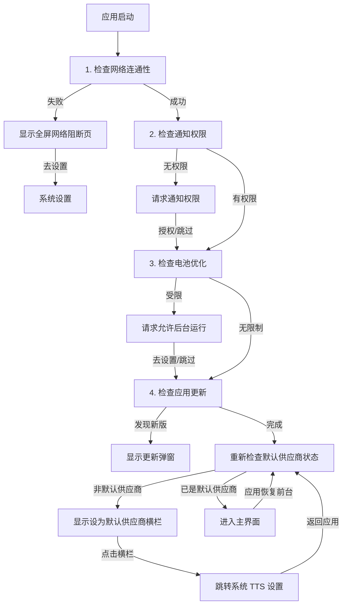

# Talkify 开发指南

本文档旨在为 Talkify 项目的开发者提供全方位的技术指导，涵盖架构设计、核心流程、代码规范及扩展指南。

## 目录

1. [项目概述](#1-项目概述)
2. [快速开始](#2-快速开始)
3. [技术架构](#3-技术架构)
4. [关键业务流程](#4-关键业务流程)
5. [配置存储方案](#5-配置存储方案)
6. [UI 与设计规范](#6-ui-与设计规范)
7. [扩展指南：添加新供应商](#7-扩展指南添加新供应商)
8. [发布与版本控制](#8-发布与版本控制)

---

## 1. 项目概述

Talkify 是一款基于 Android 的现代化 TTS (Text-to-Speech) 桥接应用。它不产生语音，而是作为**连接器**，将云端大模型（如通义千问、豆包、腾讯云）的高质量语音合成能力，通过 Android 标准 TTS 接口提供给系统和第三方阅读软件使用。

### 1.1 核心特性
- **云端驱动**：接入阿里云百炼（DashScope）、火山引擎（Volcengine）、腾讯云、微软 Azure、**MiniMax** 和 **小米 MiMo** 的流式 API。
- **架构解耦**：采用插件化架构，轻松扩展新的 TTS 服务商。
- **体验流畅**：完整的启动检查流程（网络/权限/电池优化），确保服务在后台稳定运行。
- **清爽界面**：配置项按使用频率分层展示，"高级设置"（API 地址、模型 ID 等）默认折叠，减少视觉干扰。

---

## 2. 快速开始

### 2.1 环境要求
- **IDE**: Android Studio Ladybug | 2024.2.1+
- **JDK**: JDK 17
- **Android SDK**: API 37 (compileSdk/targetSdk) / minSdk 30

### 2.2 常用命令

项目使用 Gradle 进行构建管理：

```bash
# Debug 构建（开发调试）
./gradlew assembleDebug

# Release 构建（正式包）
./gradlew assembleRelease

# 代码检查 (Lint)
./gradlew lint

# 运行单元测试
./gradlew test

# 清理构建缓存
./gradlew clean
```

### 2.3 依赖说明
关键依赖版本管理位于 `gradle/libs.versions.toml`：
- **UI**: Jetpack Compose BOM 2026.06.01
- **Navigation**: Navigation Compose 2.9.8
- **Network**: OkHttp 4.12.0（锁定版本以兼容 DashScope SDK）
- **AI SDK**: DashScope SDK 2.22.25
- **Kotlin**: 2.4.10
- **AGP**: 9.3.0
- **腾讯云TTS**: stream_tts-release-v2.0.16-20260128
- **MP3解码**: JLayer 1.0.1 (用于微软TTS和MiniMax供应商的流式MP3解码)
- **匿名统计**: Aptabase Kotlin SDK 0.0.8 (隐私优先的轻量级遥测，匿名统计活跃设备与核心功能使用情况)

---

## 3. 技术架构

Talkify 严格遵循 **MVVM (Model-View-ViewModel)** 架构模式，配合 **Clean Architecture** 的分层思想，实现逻辑与 UI 的分离。

### 3.1 核心目录结构

```text
app/src/main/java/com/github/lonepheasantwarrior/talkify/
├── MainActivity.kt                       // 【容器】极简容器，设置导航图与音量控制
├── TalkifyApplication.kt                 // 【应用类】应用初始化、通知通道创建
├── GlobalException.kt                    // 【异常处理】全局异常处理器 (TalkifyExceptionHandler) + 全局 Context 持有者 (TalkifyAppHolder)
├── TalkifyCheckDataActivity.kt           // 【检查页】供应商数据完整性校验
├── TalkifyDownloadVoiceData.kt          // 【下载页】供应商音色数据下载管理
├── TalkifySampleTextActivity.kt          // 【样本文本】预置示例文本管理
├── util/                                 // 【工具层】通用工具类
│   └── TalkifyAudioPlayer.kt             // 音频播放工具（语音预览）
├── domain/                               // 【领域层】纯 Kotlin 业务接口与模型
│   ├── model/                            // 供应商配置、更新信息等数据模型
│   │   ├── BaseProviderConfig.kt         // 供应商配置基类（voiceId/apiUrl/modelId）
│   │   ├── ConfigItem.kt                 // 配置项模型（支持 placeholder 提示）
│   │   ├── ProviderIds.kt                // 供应商 ID 密封类（providerId/defaultModelId/provider）
│   │   ├── AliyunBailianConfig.kt         // 阿里云百炼（通义千问）供应商配置
│   │   ├── VolcengineConfig.kt           // 火山引擎（豆包 Seed TTS）供应商配置
│   │   ├── TencentCloudConfig.kt         // 腾讯云语音合成供应商配置
│   │   ├── AzureConfig.kt                // 微软 Azure 语音合成供应商配置
│   │   ├── MiniMaxConfig.kt              // MiniMax 语音合成供应商配置
│   │   ├── XiaomiConfig.kt               // 小米 MiMo 语音合成供应商配置
│   │   ├── TtsProviderRegistry.kt        // 供应商注册中心（基于 ProviderIds 管理供应商元信息）
│   │   ├── TtsModels.kt                  // TTS 相关数据模型
│   │   ├── UpdateCheckResult.kt          // 更新检查结果模型
│   │   └── UpdateInfo.kt                 // 更新信息模型
│   └── repository/                       // 仓储接口定义 (Repository Interfaces)
│       ├── AppConfigRepository.kt        // 应用配置仓储接口
│       ├── ProviderConfigRepository.kt   // 供应商配置仓储接口
│       └── VoiceRepository.kt            // 音色仓储接口
├── infrastructure/                       // 【基础设施层】技术实现细节
│   ├── app/                              // 应用级设施
│   │   ├── notification/                 // 通知管理
│   │   │   ├── NotificationHelper.kt      // 通知通道创建与通知构建
│   │   │   ├── NotificationModels.kt      // TalkifyNotificationChannel 枚举、通知数据类
│   │   │   └── TalkifyNotificationHelper.kt // 业务通知快捷发送
│   │   ├── permission/                   // 权限管理
│   │   │   ├── ConnectivityMonitor.kt
│   │   │   ├── NetworkConnectivityChecker.kt
│   │   │   └── PermissionChecker.kt
│   │   ├── power/                        // 电源管理
│   │   │   └── PowerOptimizationHelper.kt
│   │   ├── telemetry/                    // 匿名遥测统计
│   │   │   ├── TalkifyTelemetry.kt        // 遥测服务（统一封装 Aptabase SDK）
│   │   │   └── DeviceInfoCollector.kt    // 匿名设备信息收集服务（零权限）
│   │   ├── update/                       // 更新检查
│   │   │   └── UpdateChecker.kt         // GitHub API 版本检查
│   │   └── repo/                         // 配置仓储实现
│   │       └── SharedPreferencesAppConfigRepository.kt
│   ├── provider/                         // 供应商级设施
│   │   └── repo/                         // 供应商仓储实现
│   │       ├── AliyunBailianConfigRepository.kt
│   │       ├── AliyunBailianVoiceRepository.kt
│   │       ├── VolcengineConfigRepository.kt
│   │       ├── VolcengineVoiceRepository.kt
│   │       ├── TencentCloudConfigRepository.kt
│   │       ├── TencentCloudVoiceRepository.kt
│   │       ├── AzureConfigRepository.kt
│   │       ├── AzureVoiceRepository.kt
│   │       ├── MiniMaxConfigRepository.kt
│   │       ├── MiniMaxVoiceRepository.kt
│   │       ├── XiaomiConfigRepository.kt
│   │       └── XiaomiVoiceRepository.kt
│   └── xml/                              // XML 资源解析工具
│       ├── VoiceXmlEntry.kt              // 音色 XML 条目数据类
│       └── VoiceXmlParser.kt             // 音色 XML 解析器
├── service/                              // 【服务层】Android Service 实现
│   ├── TalkifyTtsService.kt              // 系统 TTS 服务入口
│   ├── TalkifyTtsDemoService.kt          // Demo 预览服务
│   ├── TtsErrorCode.kt                   // 错误码定义
│   ├── TtsErrorHelper.kt                 // 错误处理工具
│   ├── TtsLogger.kt                      // 日志工具
│   ├── provider/                         // TTS 供应商统一抽象
│   │   ├── AbstractTtsProvider.kt        // 供应商抽象基类
│   │   ├── TtsProviderApi.kt             // 供应商接口定义
│   │   ├── TtsProviderFactory.kt         // 供应商工厂
│   │   ├── AudioConfig.kt                // 音频配置
│   │   ├── TextChunkSplitter.kt          // 文本分块工具（按句子边界智能切分）
│   │   ├── Mp3StreamDecoder.kt           // MP3 流式解码器（流式数据 → PCM）
│   │   └── impl/                         // 具体供应商实现
│   │       ├── AliyunBailianProvider.kt
│   │       ├── VolcengineProvider.kt
│   │       ├── TencentCloudProvider.kt
│   │       ├── AzureProvider.kt
│   │       ├── MiniMaxProvider.kt
│   │       └── XiaomiProvider.kt
└── ui/                                   // 【表现层】Jetpack Compose UI
    ├── components/                       // 通用 UI 组件
    │   ├── BatteryOptimizationDialog.kt
    │   ├── ConfigBottomSheet.kt
    │   ├── ConfigEditor.kt
    │   ├── ProviderSelector.kt
    │   ├── MarkdownText.kt
    │   ├── NetworkBlockedDialog.kt
    │   ├── NotificationPermissionDialog.kt
    │   ├── PermissionDialog.kt
    │   ├── UpdateDialog.kt
    │   └── VoicePreview.kt
    ├── screens/                           // 页面级 Composable
    │   ├── MainScreen.kt                  // 主界面（含默认供应商提示、关于应用提示横栏、Demo 试听、供应商配置）
    │   └── AboutScreen.kt                 // 关于页面（含检查更新、打赏功能）
    ├── viewmodel/                         // 状态管理
    │   └── MainViewModel.kt
    └── theme/                            // Material 3 主题定义
        ├── Color.kt
        ├── Theme.kt
        └── Type.kt
```

### 3.2 架构设计详解

#### 3.2.1 启动流程架构 (MVVM)
应用启动涉及多个复杂的异步检查步骤。为了避免 `MainActivity` 代码膨胀和弹窗冲突，我们采用 **State Machine（状态机）** 模式：

- **ViewModel (`MainViewModel`)**: 维护单一真实数据源 `uiState` (`StartupState`)。它按顺序调度检查任务，控制流程流转。
- **View (`MainScreen`)**: 响应式 UI。根据 `uiState` 的变化（如 `CheckingNetwork`, `RequestingBattery`）动态切换显示的弹窗或内容。
- **Activity (`MainActivity`)**: 极简容器，不处理任何逻辑。

#### 3.2.2 TTS 供应商架构 (Plugin-based)
供应商模块采用接口隔离设计，确保新增供应商不影响现有代码：
- **`TtsProviderApi`**: 定义标准行为（合成、停止、释放、声音查询、配置标签、默认 API 地址/模型 ID 暴露等），配套 `SynthesisParams` 封装合成参数。
- **`TtsSynthesisListener`**: 合成结果回调接口，支持音频数据流式回传、错误处理和完成通知。
- **`AbstractTtsProvider`**: 提供通用实现（日志、释放状态检查、可朗读文本检测、通用配置项标签 `api_url`/`model_id`/`voice_id` 的默认实现）。
- **`TtsProviderRegistry`**: 供应商注册中心，以 `ProviderIds` 密封类为单一数据源（每个子对象包含 `providerId` 唯一标识、`defaultModelId` 默认模型、`provider` 展示名称三个属性），管理所有可用供应商元信息，并通过 `ProviderIds.toTtsProvider()` 扩展函数转换为 UI 数据模型 `TtsProvider`。
- **`TtsProviderFactory`**: 供应商实例工厂，基于 DCL（双重检查锁定）延迟初始化注册表，统一管理 Provider、ConfigRepo、VoiceRepo 三种组件的创建，是插件化架构的核心入口。

##### 自定义 API 地址与模型 ID
每个供应商通过 `getDefaultApiUrl()` 和 `getDefaultModelId()` 暴露其默认端点和模型标识：
- 用户可在配置界面自定义 API 地址和模型 ID，未配置时自动回退到供应商默认值
- 合成时通过 `config.apiUrl.ifBlank { defaultApiUrl }` 实现优先级回退
- 当用户自定义了模型 ID 时，供应商选择器和列表中的"模型名称"展示会自适应更新
- 不支持自定义的供应商（如腾讯云使用官方 SDK）返回空字符串，配置界面自动隐藏对应字段

#### 3.2.3 应用初始化架构
- **`TalkifyApplication`**: 应用入口类，负责：
  - 初始化 `TalkifyAppHolder` 全局上下文（供供应商等组件获取 Context）
  - 注册 `TalkifyExceptionHandler` 全局异常处理器
  - 预创建两个通知通道：`TTS_PLAYBACK`（前台服务常驻）和 `SYSTEM_NOTIFICATION`（系统级通知）
  - 上报 `app_opened` 事件（附带 `DeviceInfoCollector` 收集的匿名设备画像）；`TalkifyTelemetry` 首次调用时自动初始化，无需显式管理初始化流程
- **`TalkifyExceptionHandler`**: 全局未捕获异常处理器，捕获崩溃后：
  - 发送系统通知提示用户
  - 弹出崩溃对话框（支持"重启应用"和"报告问题"两个选项）
- **`TalkifyAppHolder`**: 全局 Context 持有者，避免供应商层对 Android 组件的直接依赖

#### 3.2.4 匿名遥测架构 (Aptabase)

Talkify 集成 [Aptabase](https://aptabase.com/) 进行**隐私优先**的匿名使用统计，帮助开发者了解活跃设备数及核心功能使用情况，**不收集任何可标识用户或设备的信息**。

##### 核心组件

- **`TalkifyTelemetry`** (`infrastructure/app/telemetry/`): 遥测服务（`object` 单例），对 `Aptabase.instance` 进行统一封装，作为整个应用遥测能力的**唯一入口**。
  - **自举设计**：服务内部持有 `APTABASE_KEY`，通过 `TalkifyAppHolder` 自主获取 Context，首次 `trackEvent()` 调用时通过 DCL（双重检查锁定）延迟初始化 SDK。调用方无需传入任何配置，也无需关心初始化状态。
  - 对外仅暴露 `trackEvent(name)` 和 `trackEvent(name, properties)` 两个方法，若 Context 尚未就绪则静默跳过，遥测绝不引发崩溃。
- **`DeviceInfoCollector`** (`infrastructure/app/telemetry/`): 匿名设备信息收集服务（`object` 单例），负责在不使用任何运行时权限的前提下收集设备画像。
- **`TalkifyApplication.reportAppOpened()`**: 应用层唯一一处直接调用 `TalkifyTelemetry.trackEvent()` 的位置，上报附带设备画像的 `app_opened` 事件。

##### DeviceInfoCollector 收集的信息

所有信息均来自 Android 公开 API，**零权限**，不收集 IMEI、MAC、Advertising ID 等可标识信息：

| 属性 | 来源 API | 类型 | 用途 |
|------|---------|:---:|------|
| `device_model` | `Build.MODEL` | String | 设备型号分布 |
| `device_brand` | `Build.BRAND` | String | 品牌分布 |
| `manufacturer` | `Build.MANUFACTURER` | String | 制造商分布 |
| `device_codename` | `Build.DEVICE` | String | 设备代号 |
| `soc_platform` | `Build.HARDWARE` | String | 芯片平台（兼容性分析） |
| `screen_density` | `DisplayMetrics` | String | 屏幕密度档位 (ldpi ~ xxxhdpi) |
| `country` | SIM 运营商 → Locale 降级 | String | 国家级区域分布 |
| `total_ram_mb` | `ActivityManager` | Int | 设备内存容量 |
| `is_low_ram_device` | `ActivityManager.isLowRamDevice()` | Int | 低端设备识别 |
| `network_type` | `ConnectivityManager` | String | 联网方式 (wifi/cellular/ethernet/vpn) |

##### 设计原则

- **自举初始化**：`TalkifyTelemetry` 无需外部管理生命周期，首次调用 `trackEvent()` 时自动完成初始化（DCL 线程安全）。即使 Context 尚未就绪（极端情况）也静默跳过，绝不影响业务主流程。
- **不重复**：Aptabase SDK 已自动收集的信息（OS 版本、App 版本、locale 等）不再手动上报。
- **类型合规**：所有自定义属性值严格使用 String 或 Int，遵循 Aptabase SDK 的类型限制。
- **容错隔离**：每个信息采集方法独立封装并带 try-catch，单项失败不影响其它项及主流程。
- **区域降级**：国家代码获取采用双重策略：SIM 卡注册网络运营商 → 系统 Locale，仅精确到国家级。
- **可扩展**：新增信息项只需在 `DeviceInfoCollector` 中添加一个 `collectXxx()` 私有方法。

##### 添加新的事件追踪

在任意位置通过 `TalkifyTelemetry` 统一上报：

```kotlin
// 简单事件
TalkifyTelemetry.trackEvent("event_name")

// 带属性的复合事件
TalkifyTelemetry.trackEvent("event_name", mapOf(
    "key" to "string_value",
    "count" to 42
))
```

> **注意**：整个应用应通过 `TalkifyTelemetry` 上报事件，**不要**直接引用 `com.aptabase.Aptabase`。自定义属性仅支持 `String` 和 `Int` 类型，`Boolean` 需转为 `0/1` 整数。

##### TtsTelemetryTracker —— 语音合成事件追踪

`TtsTelemetryTracker` (`infrastructure/app/telemetry/`) 负责在每次语音合成作业开始时收集合成事件信息。由于免费套餐每日配额有限，采用**限频上报策略**使每条上报都有价值：

**限频规则**（每个 `providerId_modelId` 组合独立计数）：
1. 本次使用的供应商/模型组合与上一次不一致 → **立即上报**
2. 同一组合累计合成 N 次 → **上报一次并重置计数**

**上报事件**：

| 事件名称 | 属性 | 说明 |
|---------|------|------|
| `tts_{providerId}_{modelId}` | `text_length` (Int) | 以供应商_模型为维度，直观反映各模型的调用量分布 |

**异步安全性**：
- 调用入口 `processRequestSynchronously()` 本身运行在 `Dispatchers.Default` 后台线程池，不在主线程
- `SharedPreferences.edit { }` 内部使用 `apply()` 异步写盘，不阻塞
- `TalkifyTelemetry.trackEvent()` → `Aptabase.instance.trackEvent()` 仅将事件入队即返回，SDK 自行批量提交
- 全链路 **零阻塞**，对语音合成主流程无任何性能影响

**调用示例**：

```kotlin
// 在 TalkifyTtsService.processRequestSynchronously() 中，合成开始前：
val effectiveModelId = config.modelId.ifBlank { provider.getDefaultModelId() }
TtsTelemetryTracker.trackIfNeeded(providerId, effectiveModelId, text.length)
```

---

## 4. 关键业务流程

### 4.1 应用启动自检流程

应用冷启动时，`MainViewModel` 会严格按照以下顺序执行串行检查。任何一步受阻都会暂停流程，直到用户解决或授权。



### 4.2 权限管理策略

为了保障 TTS 服务的核心体验，我们对关键权限采取**持续引导**策略：

1.  **允许后台运行 (忽略电池优化)**
    *   **必要性**：TTS 服务通常在后台运行，若被系统电池优化杀掉进程或切断网络，会导致朗读中断。
    *   **策略**：应用不保存"以后再说"的状态。只要检测到未忽略电池优化，**每次启动都会提示**。
    *   **交互**：点击"去设置"会尝试直接弹窗，失败则跳转系统列表页。

2.  **通知权限**
    *   **必要性**：用于在前台服务运行时显示"正在朗读"通知，以及错误提示。
    *   **策略**：同上，未授权则每次启动均提示。

### 4.3 语音合成流程
1. 第三方 App 调用 Android `TextToSpeech` API。
2. `TalkifyTtsService` 接收请求，解析文本和合成参数。
3. 通过请求队列（`Semaphore`）实现串行调度，确保同一时间只有一个合成任务在执行。
4. 委托给 `TtsProviderFactory.createProvider()` 创建的当前供应商实例。
5. 供应商通过网络流式请求音频数据，通过 `TtsSynthesisListener` 回调将音频数据回传给服务。
6. 数据通过 `SynthesisCallback` 写入 Android 音频管道播放。
7. 使用 `CancellableContinuation` 实现挂起式等待，配合超时机制防止无限阻塞。

### 4.4 音频播放机制
- **WakeLock**: 防止合成过程中设备进入休眠状态
- **WifiLock**: 确保 WiFi 保持高性能模式，保障流式传输稳定性
- **前台服务**: 使用 `START_STICKY` 机制确保服务被系统杀死后能够自动重启；Android 14+ 声明 `FOREGROUND_SERVICE_TYPE_SPECIAL_USE`
- **动态音频配置**: 播放器根据实际音频数据动态创建，确保采样率、格式和声道数与音频数据完全匹配

### 4.5 音频采样率动态匹配机制
为了确保音频播放质量，Talkify 实现了智能的音频采样率匹配机制：

#### 4.5.1 预览服务 (TalkifyTtsDemoService)
- **动态播放器创建**: 在收到第一个音频数据时，根据实际音频参数创建播放器
- **实时参数匹配**: 播放器使用与音频数据相同的采样率、格式和声道数
- **架构优势**: 高内聚、低耦合，适用于所有支持动态采样率的TTS供应商

#### 4.5.2 系统TTS服务 (TalkifyTtsService)
- **延迟初始化**: 系统回调在收到第一个音频数据时初始化，而非合成开始前
- **参数同步**: 确保系统播放器配置与实际音频数据完全匹配
- **符合规范**: 保持同步操作，不违反Android TTS服务规范

#### 4.5.3 腾讯云TTS供应商优化
- **音色采样率动态匹配**: 每个音色使用其最高支持的采样率（8k/16k/24k 优先选择 24k）
- **文本分块处理**: 支持长文本自动分块（每块最多 300 字符），在句子/标点处智能分割
- **参数映射**: 正确映射语速(0-200)到腾讯云离散值(-2到6)和音量(0.0-1.0)到腾讯云范围(-10到10)
- **官方SDK集成**: 使用腾讯云官方流式TTS SDK（stream_tts-release-v2.0.16），提供更稳定的连接和更好的性能

#### 4.5.4 通义千问3语音合成供应商优化
- **WAV头识别与剥离**：阿里云接口返回的音频流可能包含44字节的WAV文件头，需要精准识别并安全剥离，防止首字破音
- **双重保险机制**：
  1. **请求级干预**：在 `buildConversationParam` 中显式添加 `format=pcm` 参数，请求云端直接返回纯净PCM数据
  2. **代码级拦截**：在接收到第一个音频包时，通过检查 `RIFF` 和 `WAVE` 标识来识别WAV头，如有则安全切除前44字节
- **首字破音修复**：通过剥离WAV文件头，避免了将元数据当作波形数据播放导致的刺耳"滋"声

#### 4.5.5 微软语音合成供应商特点
- **无需API Key**: 直接使用微软Edge TTS服务，无需配置任何密钥
- **WebSocket通信**: 使用WebSocket协议进行流式音频传输
- **DRM处理**: 实现了微软TTS的Sec-MS-GEC token生成和DRM验证
- **真正的流式播放**: 使用JLayer库实现MP3流式解码，支持边接收边播放
- **管道架构**: 使用PipedInputStream/PipedOutputStream建立音频数据管道
- **协程优化**: 使用CoroutineScope替代GlobalScope，避免内存泄漏
- **现代同步机制**: 使用CompletableDeferred替代Object.wait()，实现非阻塞等待
- **动态采样率**: 从MP3 Header中动态提取真实采样率，避免"变声器"效应
- **64KB缓冲区**: 扩容管道缓冲区，彻底解放 OkHttp 网络接收能力，防止接收线程阻塞拖慢网络
- **完善的异常处理**: 支持优雅停止和错误提示
- **多语言支持**: 支持中文、英文、日文、韩文、法文、德文、西班牙文等多种语言

#### 4.5.6 微软语音合成供应商性能优化（TTFB优化）
针对首字发声延迟（TTFB, Time To First Byte）的深度优化：

1. **DNS 预热 (DNS Pre-warming)**
   - 在供应商实例化时（`init` 代码块），开一个后台线程提前去解析微软服务器的域名
   - 真正开始合成时，可以完全省去几十到上百毫秒的 DNS 耗时

2. **零拷贝与降级内存分配**
   - 使用 `ByteBuffer` 直接读取，避免多次 `ByteArray` 拷贝
   - 使用 `String.contains` 快速比对，避免正则字符串切分和 Map 创建
   - 极大减少了内存分配和 CPU 消耗，降低 GC 停顿

3. **PCM 转换加速 (NIO 优化)**
   - JLayer 解码出的 `ShortArray` 转 `ByteArray`，使用 Java NIO 的 `ByteBuffer.asShortBuffer().put()`
   - 底层内存块拷贝，效率远高于循环单字节位运算赋值

4. **线程调度优化**
   - MP3 解码属于标准的 CPU 密集型任务，将 `decodeJob` 的执行协程调度器从 `Dispatchers.IO` 改为 `Dispatchers.Default`
   - 减少线程上下文切换的等待

5. **管道缓冲区策略**
   - 纠正误区：`PipedInputStream` 只要有 1 个字节写入就会立刻返回，不会等填满才输出
   - 64KB 缓冲区确保网络下载速度快于解码速度时，OkHttp 的网络读取线程不会被阻塞

6. **请求流水线 (Request Pipelining)**
   - 跨 `synthesize()` 调用复用同一条 WebSocket 长连接，消除重复的 TCP/TLS 握手延迟
   - 预取窗口（PREFETCH_WINDOW=3）：在当前 chunk 传输音频时，后续 2 个 chunk 的 SSML 请求已提前发送至服务端排队
   - 将 chunk 间停顿从 ~3 秒降低到 <1 秒，实现近乎无缝的长文本连续朗读
   - 空闲超时机制：连接超过 60 秒未使用则主动关闭释放资源

#### 4.5.7 MiniMax 语音合成供应商特点
- **WebSocket 流式合成**: 基于 OkHttp WebSocket 实现流式音频合成，相比 HTTP 方案显著降低首字播放延迟
- **MP3 流式解码**: 使用 JLayer 库实现实时 MP3 解码，支持边接收边播放
- **管道架构**: 使用 PipedInputStream/PipedOutputStream 建立音频数据管道，64KB 缓冲区
- **高采样率**: 支持 32kHz 采样率，提供更清晰的音频质量
- **协程异步处理**: 使用 CoroutineScope 管理异步任务，避免内存泄漏
- **文本分块**: 支持长文本自动分块（每块最多 10000 字符），在句子/标点处智能分割
- **WebSocket 连接复用**: 单次合成内复用同一条 WebSocket 连接，减少握手开销

#### 4.5.8 小米 MiMo 语音合成供应商特点
- **HTTP 流式合成**: 基于 OkHttp 实现 HTTP 流式音频合成，支持连接复用
- **标准 PCM 输出**: 返回标准 PCM 16bit 24kHz 音频数据
- **API 兼容**: 使用与 OpenAI API 兼容的接口格式，便于对接
- **协程异步处理**: 使用 CoroutineScope 管理异步任务
- **连接池复用**: 使用 OkHttp ConnectionPool 复用连接
- **文本分块**: 支持长文本自动分块（每块最多 300 字符）

### 4.6 默认供应商检测
为了提供更好的用户体验，应用会在启动时检查 Talkify 是否已设置为系统的默认 TTS 引擎：

- **检测时机**：
  - 应用启动流程完成后
  - 应用从后台恢复到前台时（通过 `LifecycleEventObserver` 监听 `ON_RESUME`）
- **检测逻辑**：通过 `TextToSpeech.getDefaultEngine()` 获取当前系统默认引擎，与 Talkify 的包名进行比较
- **提示展示**：若非默认供应商，在 `MainScreen` 顶部显示提示横栏
- **交互方式**：点击横栏任意位置跳转到系统 TTS 设置页面
- **状态刷新**：用户设置完成后返回应用时，自动重新检测并更新横栏显示状态

### 4.7 关于页面与新功能提示
应用提供关于页面供用户了解应用信息，同时通过提示横栏引导用户发现新功能：

#### 4.7.1 关于页面入口
- **入口方式**：点击主界面顶部的 "Talkify" 标题文字即可打开关于页面
- **页面内容**：
  - 应用版本号
  - GitHub 开源仓库链接
  - 检查更新功能（手动触发）
  - 打赏功能（支持微信和支付宝二维码保存到相册）
- **导航实现**：使用 Jetpack Navigation Compose，支持页面切换动画和预测性返回手势

#### 4.7.2 关于应用提示横栏
为了引导用户发现关于页面，应用在主界面顶部显示提示横栏：

- **显示条件**：
  - 用户从未打开过关于页面 (`hasOpenedAboutPage` 为 false)
  - 应用启动流程已完成 (`startupState == StartupState.Completed`)
- **临时关闭**：点击横栏可临时关闭提示（本次会话中不再显示）
- **永久消失**：当用户通过点击 Talkify 标题真正打开关于页面后，提示横栏将永久消失
- **状态持久化**：关于页面打开状态存储在 `SharedPreferences` 中，键名为 `has_opened_about_page`

#### 4.7.3 检查更新功能
- **启动时检查**：应用启动时自动检查 GitHub Releases 是否有新版本
- **手动检查**：关于页面提供"检查更新"按钮，用户可手动触发更新检查
- **API 调用**：使用 GitHub REST API (`https://api.github.com/repos/{owner}/{repo}/releases/latest`)
- **错误处理**：
  - 403/404：视为无可用更新
  - 5xx 服务器错误：提示用户稍后再试
  - 网络超时：提示网络问题

#### 4.7.4 打赏功能
- **入口**：关于页面中的"打赏支持"按钮
- **渠道选择**：底部抽屉提供微信和支付宝两个选项
- **二维码保存**：
  - 从 `res/drawable` 目录读取二维码图片
  - 使用 MediaStore API 保存到手机相册（兼容 Android 11+）
  - 需要 `READ_MEDIA_IMAGES` 权限（Android 13+）或 `READ_EXTERNAL_STORAGE`（Android 11-12）
- **提示信息**：保存成功后显示操作说明，引导用户使用对应 App 扫码支付

---

## 5. 配置存储方案

应用采用轻量级的 `SharedPreferences` 进行配置持久化，统一通过 `SharedPreferencesAppConfigRepository` 管理：

1.  **应用级配置 (`AppConfigRepository`)**
    - 存储：统一的 SharedPreferences 文件 (`talkify_app_config`)
    - 内容：
      - 当前选中的供应商 ID (`selected_provider`)
      - 是否已请求过通知权限 (`has_requested_notification`)
      - 是否已打开过关于页面 (`has_opened_about_page`)
    
2.  **供应商级配置 (`ProviderConfigRepository`)**
    - 存储：各供应商独立的配置键值对
    - 内容：各供应商独立的 API Key、Voice ID、**自定义 API 地址 (`api_url`)**、**自定义模型 ID (`model_id`)** 等。
    - 扩展性：每个供应商配置类继承自 `BaseProviderConfig`，实现配置隔离。
    - 自定义 API 地址和模型 ID 为可选配置，为空时供应商自动使用默认值。

---

## 6. UI 与设计规范

项目全面拥抱 **Jetpack Compose** 和 **Material 3 Expressive** 风格。

### 6.1 弹窗规范
为了保持系统一致性和良好的阅读体验：
- **标题**：简明扼要，使用 `HeadlineSmall` 样式。
- **正文**：说明性文字必须使用 **左对齐 (`TextAlign.Start`)**，避免大段文字居中造成的阅读困难。
- **操作**：主要操作（如"去设置"）在右侧，次要操作（如"以后再说"）在左侧。

### 6.2 资源管理
- **多语言**：所有文本提取至 `res/values/strings.xml`，严禁在代码中硬编码字符串。
- **声音数据**：各供应商支持的音色列表定义在 `res/xml/xxx-voices.xml` 中，通过 `VoiceXmlParser` 统一解析，便于独立更新。
- **示例文本**：预置朗读样本文本定义在 `res/values/demo_texts.xml` 中。

### 6.3 配置编辑器 UI 规范

`ConfigEditor` 是供应商配置编辑的核心组件，采用**分层折叠**设计以保持界面清爽：

- **基础配置项**：API Key、音色选择等高频使用项，始终可见。
- **高级设置**：API 地址、模型 ID 等低频项，折叠在独立的 `AdvancedSettingsSection` 面板中，默认收起。
  - 折叠面板使用 `surfaceContainerHighest` 容器色 + 12dp 圆角，从主卡片中抬升一个视觉层级。
  - 左侧 `Tune` 图标 + 右侧 `KeyboardArrowRight` 图标，展开时箭头旋转 90°，配合 `animateFloatAsState` 实现流畅过渡。
  - 内容区使用 `AnimatedVisibility` 实现 `expandVertically` + `fadeIn` / `shrinkVertically` + `fadeOut` 组合动画（300ms）。
- **自适应逻辑**：当供应商不支持自定义 API 地址或模型 ID 时（`getDefaultApiUrl()` / `getDefaultModelId()` 返回空字符串），高级设置区域自动隐藏。

### 6.4 主题规范
- **颜色**：遵循 Material 3 色彩系统，使用 `Color.kt` 定义应用级配色。
- **字体**：使用 `Type.kt` 统一定义字体样式和排版规范。

---

## 7. 扩展指南：添加新供应商

若需接入新的 TTS 服务商，请遵循以下步骤：

1. **定义配置**：在 `domain/model` 下创建 `XxxConfig`（如 `AliyunBailianConfig`、`VolcengineConfig`），继承 `BaseProviderConfig`，包含 `apiUrl` 和 `modelId` 等 override 字段。
2. **实现供应商**：在 `service/provider/impl` 下创建 `XxxProvider`（如 `AliyunBailianProvider`、`VolcengineProvider`），继承 `AbstractTtsProvider`，实现合成逻辑。
   - 重写 `getDefaultApiUrl()` 返回默认 API 地址（不支持自定义则返回空字符串）
   - 重写 `getDefaultModelId()` 返回默认模型 ID（不支持自定义则返回空字符串）
   - 在合成方法中使用 `config.apiUrl.ifBlank { getDefaultApiUrl() }` 实现自定义回退
   - 重写 `getConfigLabel()` 时，将非供应商特有 key 委托给 `super`（基类已实现 `api_url`/`model_id`/`voice_id` 通用标签）
3. **实现仓储**：在 `infrastructure/provider/repo` 下创建对应的 Voice 和 Config 仓储实现（如 `XxxConfigRepository`、`XxxVoiceRepository`），确保存取 `api_url` 和 `model_id` 字段。
4. **注册供应商**：
   - 在 `ProviderIds` 密封类中添加 `data object`，定义 `providerId`、`defaultModelId`、`provider` 三个属性。
   - 在 `TtsProviderRegistry` 中注册供应商信息（使用 `ProviderIds.toTtsProvider()` 扩展函数）。
   - 在 `TtsProviderFactory` 中注册供应商实例创建逻辑（Provider、ConfigRepo、VoiceRepo 三种组件的映射）。
5. **添加音色资源**：在 `res/xml` 下创建音色 XML 资源文件，通过 `VoiceXmlParser` 解析。
6. **编写测试**：在 `app/src/test/java` 下编写单元测试验证供应商功能。

> **供应商示例**：
> - **阿里云百炼（aliyunBailian）**：HTTP 流式合成供应商，配置类为 `AliyunBailianConfig`，供应商实现为 `AliyunBailianProvider`，音色定义在 `bailian_qwen3_tts_voices.xml`。
> - **微软 Azure 语音合成（azure）**：无需 API Key 的 TTS 服务，配置类为 `AzureConfig`，供应商实现为 `AzureProvider`，音色定义在 `microsoft_tts_voices.xml`。
> - **MiniMax 语音合成（miniMax）**：WebSocket 流式合成供应商，配置类为 `MiniMaxConfig`，供应商实现为 `MiniMaxProvider`，音色定义在 `minimax_voices.xml`，音频格式为 MP3，支持 `continuousSound` 连续发声开关。
> - **小米 MiMo 语音合成（xiaomi）**：HTTP 流式合成供应商，配置类为 `XiaomiConfig`，供应商实现为 `XiaomiProvider`，音色定义在 `xiaomi_mimo_voices_v2p5.xml`。

---

## 8. 发布与版本控制

### 8.1 版本号规范
- **versionName**: `Major.Minor.Patch` (当前 1.0.27)
- **versionCode**: 单调递增整数 (当前 29)

### 8.2 发布检查清单
- [ ] 确保 `gradle/libs.versions.toml` 中的库版本为最新稳定版。
- [ ] 运行 `lint` 检查潜在问题。
- [ ] 运行 `test` 确保单元测试通过。
- [ ] 验证启动全流程（全新安装、覆盖安装）。
- [ ] 验证所有供应商的 API Key 配置能否正常保存和读取。

---

## 9. 示例代码与测试

### 9.1 示例代码
项目提供以下示例代码供参考：
- `examples/AudioParameters.java`: 音频参数配置示例
- `examples/ProcessingReal‑timePlayback.java`: 实时播放处理示例
- `examples/StreamingOutputRequest.java`: 流式输出请求示例
- `examples/tts_http_demo.py`: Python HTTP 流式合成示例

### 9.2 测试覆盖
- **单元测试**: `app/src/test/java/` 目录
  - `ExampleUnitTest.kt`: 基础单元测试
  - `TtsErrorCodeTest.kt`: 错误码测试
- **仪表盘测试**: `app/src/androidTest/java/` 目录
  - `ExampleInstrumentedTest.kt`: 仪器化测试

---

*文档最后更新时间: 2026年07月21日*
*对应应用版本: 1.0.27*